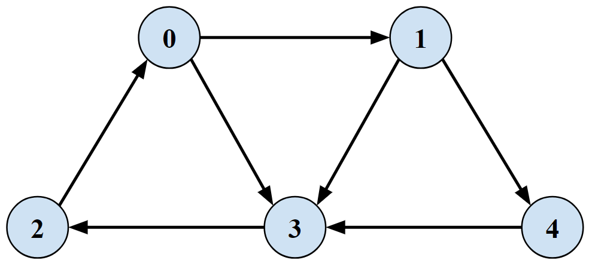
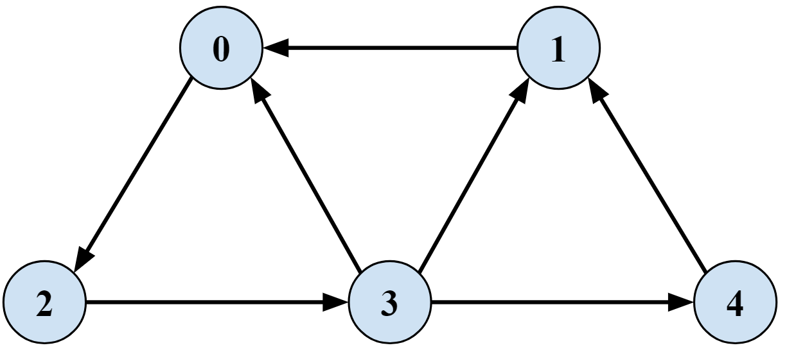
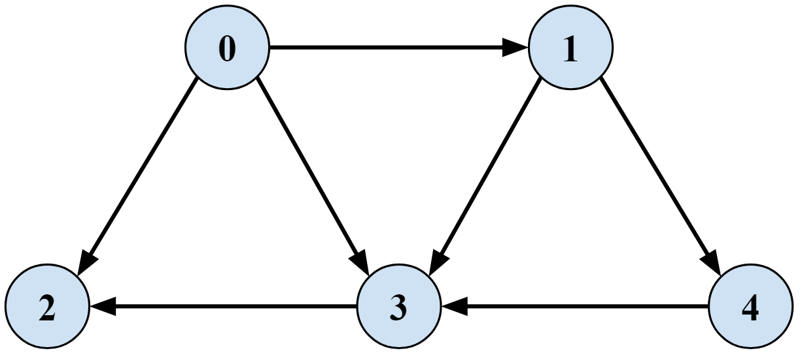
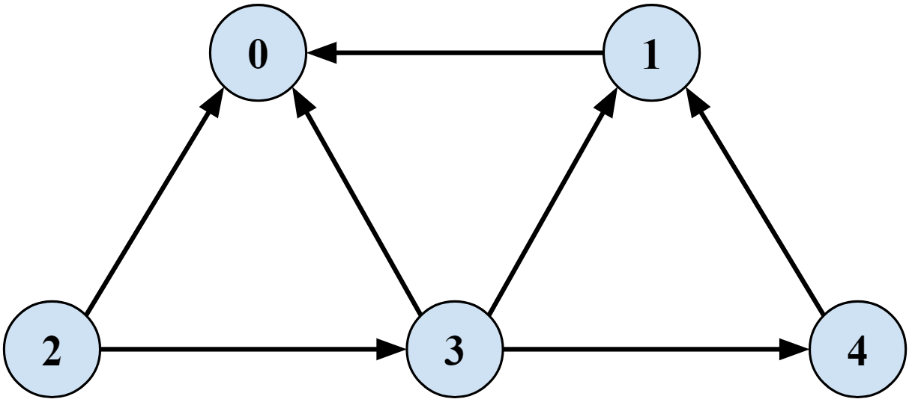

# Strong Connectivity

## Application of Breadth-First Search to Determine Strong Connectivity in Directed Graphs

### Problem Statement
Vertices \( u \) and \( v \) are mutually reachable if there is a path from \( u \) to \( v \) and also a path from \( v \) to \( u \). A directed graph is strongly connected if every pair of nodes is mutually reachable.

### Algorithm
1. Run BFS from any vertex.
2. Create \( G_rev \), a new graph with edge directions reversed.
3. Run BFS on \( G_rev \).
4. Return true if every vertex is reachable in both BFS on \( G \) and BFS on \( G_{\text{rev}} \).

### Input Graphs

**Graph 1 (Strongly Connected)**

**Graph 1 Reversed**

**Graph 2 (Not Strongly Connected)**

**Graph 2 Reversed**

### Usage
1. Instantiate a new `StrongConnectivity` object.
2. Create a graph as an `ArrayList<ArrayList<Integer>>` adjacency list.
   - Each `graph.get(u)` is an `ArrayList<Integer>` of vertices representing edges going from vertex \( u \).
   - Vertex names are simply increasing integer values; no need for human-readable vertex IDs like S or T.
   - Graph adjacency list must have all edges represented. If there are no outgoing edges from a vertex, add an empty `ArrayList`.
     `graph2.add(new ArrayList<Integer>());`
3. Call `isStronglyConnected()` and pass in a graph.
   `boolean isGraph1StronglyConnected = strongConnectivityFinder.isStronglyConnected(graph1);`

### Code Notes
- `isStronglyConnected()` always chooses vertex 0 to start BFS, but that's completely arbitrary.

### References
- [Strong Connectivity - Richard Zanibbi](https://www.cs.rit.edu/~rlaz/algorithms20082/slides/DAGs.pdf#page=4)
- [Strong Connectivity - Kevin Wayne](https://www.cs.princeton.edu/~wayne/kleinberg-tardos/pdf/03Graphs.pdf#page=41)
- [Strong Connectivity - Jaehyun Park](https://web.stanford.edu/class/cs97si/06-basic-graph-algorithms.pdf#page=36)
